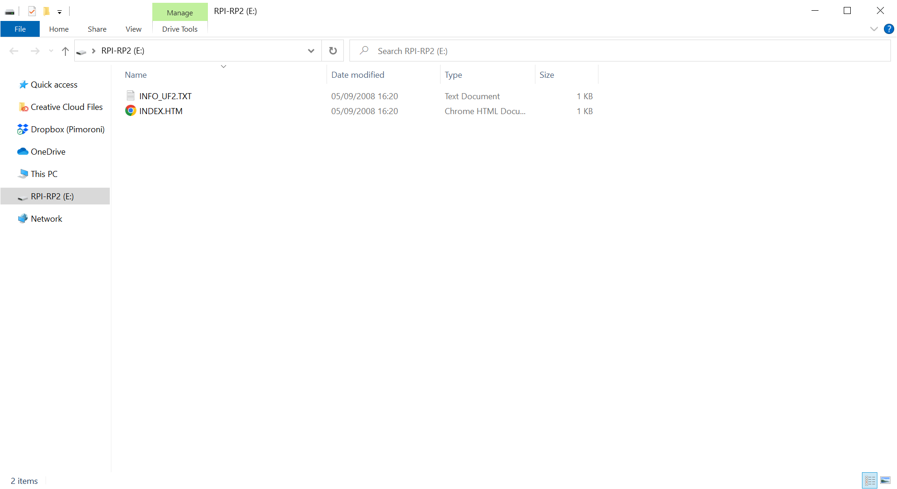

# Installing MicroPython  <!-- omit in toc -->

- [Which file to download?](#which-file-to-download)
- [Entering DFU/bootloader mode](#entering-dfubootloader-mode)
- [Copying the firmware to your PicoVision](#copying-the-firmware-to-your-picovision)
- [Where are the examples?](#where-are-the-examples)
- [Troubleshooting](#troubleshooting)

We provide pre-built MicroPython images which include all the libraries and drivers you'll need to get started with PicoVision. To install MicroPython, you'll need to **copy the appropriate .uf2 file from the releases page to your device while it's in DFU/bootloader mode.**

## Which file to download?

On the releases page you'll find two .uf2 files. A widescreen and a regular build of the PicoVision firmware.

- [Releases page](https://github.com/pimoroni/pimoroni-picovision/releases)

| Build                                                     | .uf2 File                                             |
|-----------------------------------------------------------|-------------------------------------------------------|
| Normal resolutions, up to 80 sprites.                     | pimoroni-picovision-vX.X.X-micropython.uf2            |
| Widescreen (max 1280x720†) resolutions, up to 32 sprites. | pimoroni-picovision-widescreen-vX.X.X-micropython.uf2 | 

* † @ 30Hz, limited support on displays

## Entering DFU/bootloader mode

With your PicoVision plugged into your computer, just **hold down the BOOTSEL button and tap RESET**. A new drive should pop up on your computer called 'RPI_RP2'. 

## Copying the firmware to your PicoVision

**Copy the downloaded firmware image across to the 'RPI-RP2' drive**. Once it has finished uploading (which takes a few seconds) the board will restart itself.

⚠ Note that once your board restarts running MicroPython it will no longer show up as a drive. To program it and to transfer files to and from it you'll need to use an interpreter, such as Thonny or Mu.

- [Download Thonny](https://thonny.org/)
- [Download Mu](https://codewith.mu/)

You can also transfer files to boards running MicroPython using command line tools, like `mpremote`.

- https://docs.micropython.org/en/latest/reference/mpremote.html

## Where are the examples?

Note that most of our MicroPython images don't include examples, so you'll need to copy across the ones you want using Thonny. You can find all our MicroPython examples at the link below.

- [MicroPython examples](/pimoroni/picovision/tree/main/examples)

## Troubleshooting

Having trouble getting started? Check out the link below:

- :link: [MicroPython FAQs](https://github.com/pimoroni/pimoroni-pico/blob/main/faqs-micropython.md)
